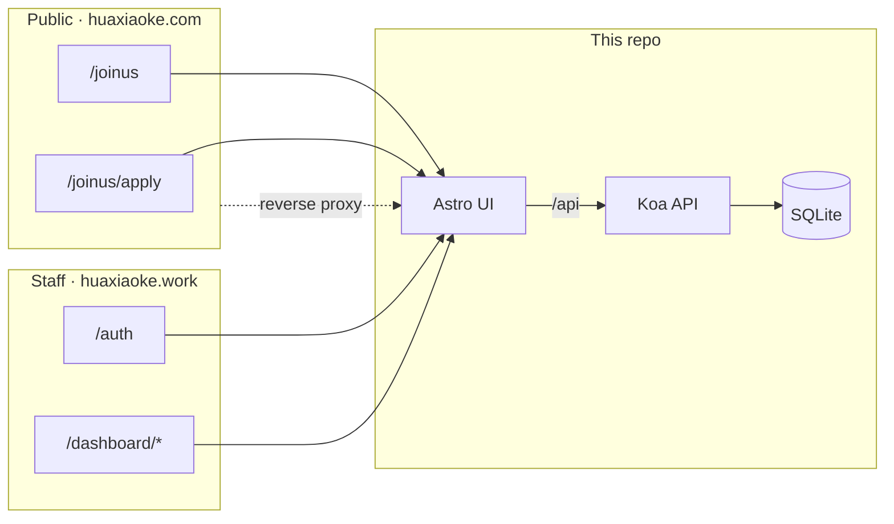

# HxkToolBox

Stuff we use to run 华小科 day to day — staff console on one side, public join-us funnel on the other.



---

## Surfaces

| | Staff console · `huaxiaoke.work` | Join-us · `huaxiaoke.com/joinus` |
| --- | --- | --- |
| What | Login → announcements, calendar, tasks, candidate review, members, settings | Landing + apply form |
| Routes | `/dashboard/*` · `/auth` | `/joinus` · `/joinus/apply` |
| Note | — | Proxied from `.com`. Proxy + submit flow stay as-is. |

---

## Name map

| You see… | It actually means… |
| --- | --- |
| `joinus` | Public recruitment entry |
| `recruitment` | Internal candidate review |
| `application` | Account signup request (not the join-us form) |
| `newcomers` | Candidate review page (route name) |
| `/dashboard/list` | Schedule todos |

---

## Repo map

```
src/client/     Astro UI
src/server/     Koa API
src/joinus/     Shared form schema / validation
public/joinus/  Public form config (form.json, …)
deploy/         nginx & deploy bits
script/         build / release helpers
```

---

## Local

```bash
bun install

bun run src/server/index.ts   # API → :3000  (.env)
bun run dev                   # UI  → :4321  (/api → BACKEND_ORIGIN)
```

| Check | Command |
| --- | --- |
| types | `bun run typecheck` |
| lint | `bun run lint` |
| build | `bun run build` |

Stack notes → [`.github/README.md`](.github/README.md)
